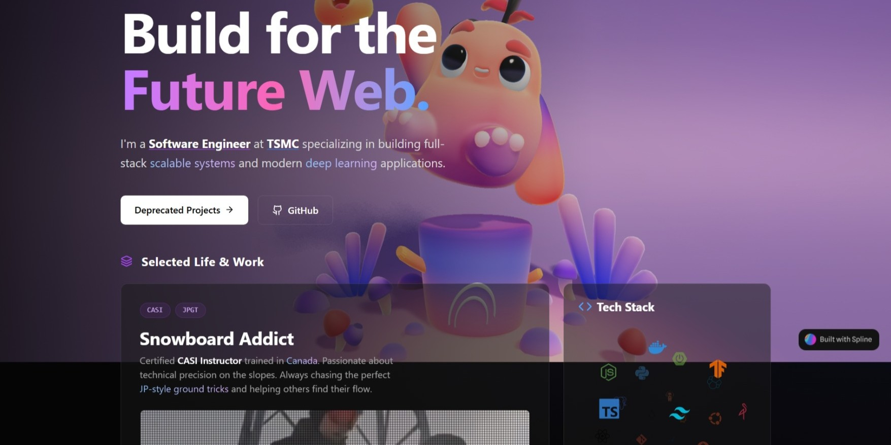

# ⚡️ Web3-Style Developer Portfolio

> A modern, high-performance personal portfolio website built with React, TypeScript, and Tailwind CSS. Featuring a "Web3" aesthetic with dark mode, glassmorphism, and interactive 3D elements.



## ✨ Features

* **🎨 Web3 Aesthetic**: Deep dark mode, neon glows, glassmorphism (backdrop-blur), and noise textures.
* **🍱 Bento Grid Layout**: A fully responsive grid layout that adapts perfectly from mobile to desktop.
* **🔦 Spotlight Effect**: Custom mouse-tracking spotlight effect on cards using React hooks.
* **🌍 Interactive 3D Globe**: A draggable, auto-rotating 3D dot-matrix globe using `cobe`.
* **☁️ 3D Icon Cloud**: Interactive floating tech stack sphere using `react-icon-cloud`.
* **🧊 Spline 3D Integration**: Immersive 3D background scenes with GSAP entrance animations.
* **⚡️ High Performance**: Built with Vite for instant server start and HMR.

## 🛠 Tech Stack

* **Core**: [React 18](https://reactjs.org/), [TypeScript](https://www.typescriptlang.org/), [Vite](https://vitejs.dev/)
* **Styling**: [Tailwind CSS](https://tailwindcss.com/)
* **Animation**: [Framer Motion](https://www.framer.com/motion/), [GSAP](https://greensock.com/gsap/)
* **3D & Interactive**:
    * [`@splinetool/react-spline`]([https://spline.design/](https://spline.design/)) (Hero Background)
    * [`cobe`]([https://github.com/shuding/cobe](https://github.com/shuding/cobe)) (Interactive Globe)
    * [`react-icon-cloud`]([https://github.com/render-props/react-icon-cloud](https://github.com/render-props/react-icon-cloud)) (Tech Stack)
* **Icons**: [Lucide React](https://lucide.dev/)

## 🚀 Getting Started

### Prerequisites

* Node.js (v18 or higher recommended)
* npm or yarn

### Installation

1.  **Clone the repository**
    ```bash
    git clone https://github.com/chienhsiang-hung/chienhsiang-hung.github.io.git
    cd chienhsiang-hung.github.io
    ```

2.  **Install dependencies**
    ```bash
    npm install
    ```

3.  **Run development server**
    ```bash
    npm run dev
    ```

4.  **Build for production**
    ```bash
    npm run build
    ```

## 📂 Project Structure

```text
src/
├── components/
│   ├── InteractiveIconCloud.tsx  # 3D Tech Stack Sphere
│   ├── LocationCard.tsx          # Draggable Cobe Globe + Clock
│   ├── SpotlightCard.tsx         # Reusable Card with Hover Glow
│   └── ...
├── App.tsx                       # Main Layout & Bento Grid
├── main.tsx                      # Entry Point
└── index.css                     # Global Styles & Tailwind Directives
public/
└── my-demo-video.mp4             # Video assets
```

## ⚙️ Customization Guide

### 1. Changing the 3D Background
Go to `App.tsx` and replace the Spline URL with your own scene from Spline.design:
```tsx
<Spline scene="YOUR_NEW_SPLINE_URL" onLoad={onLoad} />
```

### 2. Updating Tech Stack Icons
Edit `src/components/InteractiveIconCloud.tsx`. Add or remove slugs from the `iconSlugs` array (refer to [Simple Icons](https://simpleicons.org/) for valid slugs):
```tsx
const iconSlugs = [
  "typescript",
  "react",
  "nextdotjs",
  // ... add more
];
```

### 3. Changing the Globe Markers (Location)
Edit `src/components/LocationCard.tsx` inside the `markers` array:
```tsx
markers: [
  { location: [24.774, 121.047], size: 0.1 }, // Your Lat/Long (e.g., Hsinchu)
],
```

### 4. Updating the Snowboard Video
Place your video file in the `public` folder and update the `src` in `App.tsx`:
```tsx
<source src="/your-video-filename.mp4" type="video/mp4" />
```

## 🐳 Docker Development (Optional)

If you prefer using Docker to avoid environment issues:

```bash
# Run the container with port mapping and volume mount
docker run -it --rm -v "${PWD}:/app" -w /app -p 5173:5173 node:24-alpine sh

# Inside the container
npm install
npm run dev
```

## 📄 License

This project is open source and available under the [MIT License](LICENSE).

---

Designed & Built by **[Chien-Hsiang Hung](https://github.com/chienhsiang-hung)**.